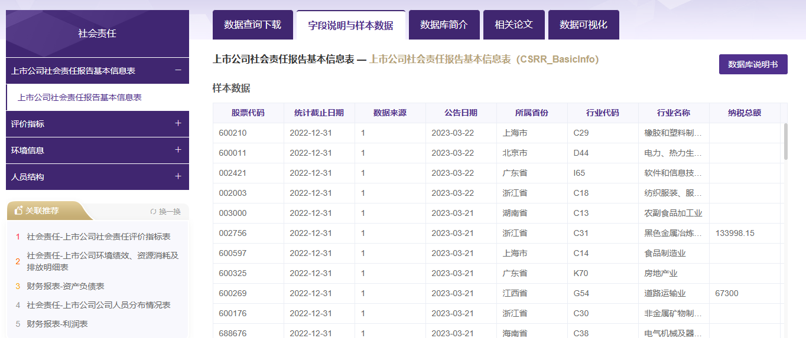

+++
author = "Joseph"
title = "CSR范围一致性 & 重点差异化"
date = "2026-08-07"
description = "CSR Scope Conformity & Emphasis Differentiation"
slug= "scope-emphasis"
image= "cover.png"
categories = [
    "CSR indicator"
]
tags = [
    "CSR"
]
+++

## 1. 研究背景与目标

### 1.1 研究问题

[Zhang et al. (2020) ](https://doi.org/10.5465/amj.2017.0412) 认为企业社会责任战略包含两个维度：一是范围维度，反映了目标企业所覆盖的不同企业社会责任领域的数量；二是重点维度，评估了目标企业在每个企业社会责任领域的努力程度。其中，企业社会责任的范围维度与企业社会实践的合法性有关，而企业社会责任的重点维度更加抽象，允许企业选择不同的重点，使企业的社会责任实践与同行相比更加独特。

本文旨在使用Python计算上述两个维度：

- **Scope Conformity（范围一致性）**：衡量企业CSR披露议题范围与行业主流议题的吻合程度
- **Emphasis Differentiation（重点差异化）**：衡量企业在各CSR议题上的投入分配与行业平均水平的偏离程度

### 1.2 数据基础

如下图所示，本文使用CSMAR提供的`上市公司社会责任报告基本信息表`

涵盖：
- **时间跨度**：2006年 - 2024年
- **原始数据量**：332,076条披露记录
- **有效样本**：清洗后326,147条（剔除行业代码缺失的企业）

### 1.3 CSR议题分类体系
与 [Zhang et al. (2020)](https://doi.org/10.5465/amj.2017.0412) 保持一致，剔除“是否披露公司存在的不足”，只取以下9个议题类别：

| 编码 | 披露内容类型 |
|:----:|:-----|
| S3301 | 股东权益保护 |
| S3302 | 债权人权益保护 |
| S3303 | 职工权益保护 |
| S3304 | 供应商权益保护 |
| S3305 | 客户及消费者权益保护 |
| S3306 | 环境和可持续发展 |
| S3307 | 公共关系和社会公益事业 |
| S3308 | 社会责任制度建设及改善措施 |
| S3309 | 安全生产内容 |

## 2. 数据来源与预处理

### 2.1 数据源

| 数据文件 | 说明 |
|:----|:-----|
| CSRR_EvaluationIndex.csv | 上市公司社会责任评价指标表，包含披露项目名称、数值、单位等 |
| CG_Co.xlsx | 公司基本情况文件，包含行业分类代码（使用2012版证监会行业分类） |

### 2.2 数据清洗流程

```
原始数据 (332,076行)
    ↓
合并行业代码 (基于股票代码匹配)
    ↓
剔除缺失行业代码的记录
    ↓
清洗后数据 (326,147行)
```

### 2.3 关键变量定义

| 变量名 | 定义 | 说明 |
|:-------|:-----|:-----|
| StockCode | 股票代码 | 上市公司唯一标识 |
| Year | 年份 | 统计截止日期的年份 |
| DisclosureType | 披露内容类型编码 | 对应9大CSR议题 |
| IndustryCode | 行业代码 | 2012版证监会行业分类代码 |
| X_ikt | 原始披露次数 | 公司i在t年对议题k的披露次数 |

## 3. 核心概念与指标定义

### 3.1 双模从属网络 (Bipartite Affiliation Network)

本研究构建了一个**双模网络**结构：

```
┌─────────────────────────────────────────────────────────┐
│                    双模从属网络                           │
├─────────────────────────────────────────────────────────┤
│                                                         │
│    公司 (Firms)              议题 (Issues)              │
│    ─────────                 ──────────                │
│    ● 公司 A  ────────────────● 股东权益保护             │
│    ● 公司 B  ────┬───────────● 债权人权益保护           │
│    ● 公司 C  ────┼───────────● 职工权益保护             │
│    ● 公司 D  ────┼───────────┼─● 供应商权益保护         │
│    ...      ────┼───────────┼─● 客户权益保护           │
│              ───┘         ──┴─● 环境保护               │
│                        ──────● 公益事业                 │
│                        ──────● 制度建设                 │
│                        ──────● 安全生产                 │
│                                                         │
│    左模：上市公司节点                                   │
│    右模：9个CSR议题类别                                 │
│    连边：披露关系（披露次数作为权重）                    │
│                                                         │
└─────────────────────────────────────────────────────────┘
```

### 3.2 特征向量中心性 (Eigenvector Centrality, CEN)

**概念解释**：特征向量中心性衡量一个节点在网络中的"重要性"。在CSR议题网络中，如果一个议题与其他多个重要议题共同出现（即被同一批公司同时披露），则该议题具有更高的中心性。

**行业-年份层面的权重含义**：
- $CEN_{k,t-1}$ 表示在行业 $j$ 的 $t-1$ 年，议题 $k$ 在议题共现网络中的相对重要性
- 滞后一期设计反映了行业CSR关注焦点的**时间惯性**

### 3.3 Scope Conformity（范围一致性）

**核心思想**：企业披露的CSR议题范围与行业主流"应该披露"的议题范围越吻合，一致性越高。

**直观理解**：
- 若企业披露了行业认为"重要"的议题 → 高Scope Conformity
- 若企业只披露边缘性议题 → 低Scope Conformity

### 3.4 Emphasis Differentiation（重点差异化）

**核心思想**：即使披露了相同的议题组合，企业在各议题上的资源分配模式也可能与行业平均大相径庭。

**直观理解**：
- 若企业各议题投入比例与行业平均完全一致 → Emphasis Differentiation = 0
- 若企业在"非主流"议题上投入过多 → 高Emphasis Differentiation


## 4. 计算公式详解

### 4.1 步骤一：构建企业-议题披露矩阵

对于每个行业-年份组合，构建**二元从属矩阵** $M$：

$$
M_{ik} = 
\begin{cases}
1 & \text{若公司 } i \text{ 在 } t \text{ 年披露了议题 } k \ (x_{ikt} > 0) \\
0 & \text{否则}
\end{cases}
$$

其中 $S_{ikt}$ 是 $X_{ikt}$ 的二元化表示（是否披露）。

```
企业-议题披露矩阵 M ( Firms × Issues )

           S3301   S3302   S3303   S3304   ...   S3309
公司1  [   0       0       1       0   ...    0   ]
公司2  [   1       0       1       0   ...    1   ]
公司3  [   0       1       0       1   ...    0   ]
...
```

### 4.2 步骤二：构建单模共现矩阵

将双模矩阵转换为**单模议题共现矩阵** $W$：

$$
W = M^T \cdot M
$$

其中 $W_{k_1, k_2}$ 表示同时被披露议题 $k_1$ 和 $k_2$ 的企业数量。

```
议题共现矩阵 W ( Issues × Issues )

           S3301   S3302   S3303   ...   S3309
S3301  [   N_11     W_12     W_13  ...    W_19 ]
S3302  [   W_21     N_22     W_23  ...    W_29 ]
S3303  [   W_31     W_32     N_33  ...    W_39 ]
...
S3309  [   W_91     W_92     W_93  ...    N_99 ]

其中 W_ij = W_ji，对角线 N_ii 表示议题i的总数
```

### 4.3 步骤三：计算特征向量中心性 (CEN)

对共现矩阵 $W$ 构建无向加权图 $G$，计算每个议题节点的**特征向量中心性**：

$$
CEN_k = \frac{1}{\lambda} \sum_{j} w_{kj} \cdot v_j
$$

其中 $\lambda$ 是最大特征值，$v_j$ 是对应的特征向量分量。

**标准化处理**：

$$
CEN_{k,t-1} = \frac{CEN_k}{\sum_{k=1}^{K} CEN_k}
$$

确保所有议题的中心性之和为1，便于加权求和。

**滞后一期设计**：
$$
CEN_{k,t-1} = CEN_{k} \text{ from year } (t-1)
$$

这保证了：
1. 避免内生性问题（当年的披露行为不能影响当年的权重）
2. 反映行业CSR关注焦点的**时间稳定性**

### 4.4 步骤四：计算行业平均投入 ($\bar{x}_{jkt}$)

**公式**：

$$
\bar{x}_{jkt} = \frac{1}{N_{jt}} \sum_{i \in j} x_{ikt}
$$

| 符号 | 定义 |
|:----:|:-----|
| $j$ | 行业代码 |
| $k$ | 议题编号 (1到9) |
| $t$ | 年份 |
| $N_{jt}$ | 行业 $j$ 在年份 $t$ 的公司数量 |
| $x_{ikt}$ | 公司 $i$ 在年份 $t$ 对议题 $k$ 的披露次数 |

### 4.5 步骤五：计算 Scope Conformity（范围一致性）

**公式**：

$$
\text{Scope Conformity}_{it} = \sum_{k=1}^{K} \underbrace{SR_{ikt}}_{\text{公司是否披露}} \times \underbrace{CEN_{k,t-1}}_{\text{议题重要性权重}}
$$

其中：
$$
CSR_{ikt} = 
\begin{cases}
1 & \text{若 } x_{ikt} > 0 \\
0 & \text{否则}
\end{cases}
$$

**分解说明**：

| 组件 | 含义 |
|:-----|:-----|
| $S_{ikt}$ | 公司i是否披露了议题k（二元变量） |
| $CEN_{k,t-1}$ | 议题k在行业中的相对重要性权重 |
| 求和 | 对9个议题进行加权求和 |

**取值范围**：$[0, 1]$

- **SC = 1**：企业披露了所有行业认为"重要"的议题
- **SC = 0**：企业未披露任何行业认为"重要"的议题
- **SC 越接近1**：披露范围与行业主流越吻合

### 4.6 步骤六：计算 Emphasis Differentiation（重点差异化）

#### 4.6.1 计算投入比例

**企业投入比例 (Firm's Emphasis, FE)**：

$$
FE_{ikt} = \frac{x_{ikt}}{\sum_{k=1}^{K} x_{ikt}} = \frac{x_{ikt}}{X_{it}}
$$

**行业平均投入比例 (Averaged Emphasis, AE)**：

$$
AE_{jkt} = \frac{\bar{x}_{jkt}}{\sum_{k=1}^{K} \bar{x}_{jkt}}
$$

#### 4.6.2 计算加权差异化指标

**公式**：

$$
\text{Emphasis Differentiation}_{it} = \sum_{k=1}^{K} \underbrace{|FE_{ikt} - AE_{jkt}|}_{\text{绝对差异}} \times \underbrace{CEN_{k,t-1}}_{\text{权重}}
$$

**直观理解**：
- 对于每个议题，计算企业投入比例与行业平均的**绝对差异**
- 用该议题的**行业重要性**作为权重进行加权
- 高权重议题上的偏离会对整体指标产生更大影响

**取值范围**：$[0, 1]$（理论上，但由于CEN标准化为1且有9个议题，最大值约为1）

### 4.7 步骤七：Z-Score标准化

对原始指标进行标准化处理，消除量纲影响：

**Scope Conformity 标准化**：

$$
SC_{Z,it} = \frac{SC_{it} - \mu_{SC}}{\sigma_{SC}}
$$

**Emphasis Differentiation 标准化**：

$$
ED_{Z,it} = \frac{ED_{it} - \mu_{ED}}{\sigma_{ED}}
$$

| 符号 | 定义 |
|:----:|:-----|
| $\mu$ | 样本均值 |
| $\sigma$ | 样本标准差 |

标准化后的指标：
- 均值为0
- 标准差为1
- 便于后续回归分析中的比较

## 5. 算法流程图

```
┌─────────────────────────────────────────────────────────────────────────────┐
│                           主算法流程                                         │
└─────────────────────────────────────────────────────────────────────────────┘

[1] 数据加载与预处理
    │
    ├─ 加载CSR披露数据 (332,076行)
    ├─ 加载行业代码数据
    ├─ 合并数据
    └─ 剔除缺失行业代码 → 326,147行

[2] 构建企业-议题披露计数
    │
    ├─ 按 (公司, 年份, 议题) 分组计数
    ├─ 构建笛卡尔积补全所有组合
    └─ 缺失值填充为0

[3] 计算行业平均投入
    │
    └─ X̄_jkt = mean(X_ikt) 按 (行业, 年份, 议题) 分组

[4] 计算特征向量中心性 (CEN)
    │
    ├─ 对每个 (行业, 年份) 组合：
    │   ├─ 构建二元从属矩阵 M (公司×议题)
    │   ├─ 计算共现矩阵 W = M^T × M
    │   ├─ 构建网络图 G
    │   ├─ 计算 eigenvector_centrality(G)
    │   └─ 标准化 CEN_k / ΣCEN_k
    ├─ 滞后一期: CEN_{k,t-1}
    └─ 第一年缺失值填充为0

[5] 计算 Scope Conformity
    │
    ├─ 二元化: S_ikt = 1(X_ikt > 0)
    ├─ 加权求和: Σ(S_ikt × CEN_{k,t-1})
    └─ 按 (公司, 年份) 聚合

[6] 计算 Emphasis Differentiation
    │
    ├─ 计算企业总投入: X_it = ΣX_ikt
    ├─ 计算投入比例: FE = X_ikt / X_it
    ├─ 计算行业平均比例: AE = X̄_jkt / ΣX̄_jkt
    ├─ 加权绝对差异: Σ(|FE - AE| × CEN_{k,t-1})
    └─ 按 (公司, 年份) 聚合

[7] Z-Score 标准化
    │
    ├─ SC_Z = (SC - μ_SC) / σ_SC
    └─ ED_Z = (ED - μ_ED) / σ_ED

[8] 输出结果
    │
    └─ 保存至 CSR scope & emphasis_final_results.csv
```

## 6. 输出结果说明

### 6.1 结果文件

**文件路径**：`CSR scope & emphasis_final_results.csv`

### 6.2 输出变量

| 变量名 | 类型 | 说明 |
|:-------|:-----|:-----|
| StockCode | int | 股票代码 |
| Year | int | 年份 |
| ScopeConformity | float | 范围一致性原始值 |
| EmphasisDifferentiation | float | 重点差异化原始值 |
| ScopeConformity_Z | float | 范围一致性Z-score标准化值 |
| EmphasisDifferentiation_Z | float | 重点差异化Z-score标准化值 |

### 6.3 描述性统计

#### Scope Conformity

| 统计量 | 值 |
|:-------|:---:|
| 均值 | 0.172 |
| 标准差 | 0.281 |
| 最小值 | 0.000 |
| 25%分位 | 0.000 |
| 中位数 | 0.000 |
| 75%分位 | 0.333 |
| 最大值 | 1.000 |

**解读**：
- 中位数为0表示超过50%的企业-年份观测值的Scope Conformity为0（即未披露任何行业认为重要的议题）
- 最大值为1表示存在少数企业完全符合行业主流CSR披露范围

#### Emphasis Differentiation

| 统计量 | 值 |
|:-------|:---:|
| 均值 | 0.047 |
| 标准差 | 0.068 |
| 最小值 | 0.000 |
| 25%分位 | 0.001 |
| 中位数 | 0.003 |
| 75%分位 | 0.111 |
| 最大值 | 0.994 |

**解读**：
- 大多数企业的重点差异化程度较低（中位数仅0.003）
- 少数企业表现出极大的差异化（最大接近1）

## 7. 方法论意义

### 7.1 创新点

1. **网络科学的应用**：利用特征向量中心性捕捉议题间的复杂关联，而非简单的频率统计
2. **动态权重机制**：滞后一期的CEN设计保证了权重的外生性
3. **行业基准对比**：将企业行为置于行业背景下进行比较

### 7.2 研究价值

| 指标 | 研究价值 |
|:-----|:---------|
| Scope Conformity | 衡量企业CSR披露的"合规性"与"全面性" |
| Emphasis Differentiation | 衡量企业CSR战略的"差异化"程度 |

## 参考文献

Zhang, Y., Wang, H., Zhou, X., 2020. Dare to Be Different? Conformity Versus Differentiation in Corporate Social Activities of Chinese Firms and Market Responses. Academy of Management Journal 63, 717–742. https://doi.org/10.5465/amj.2017.0412
